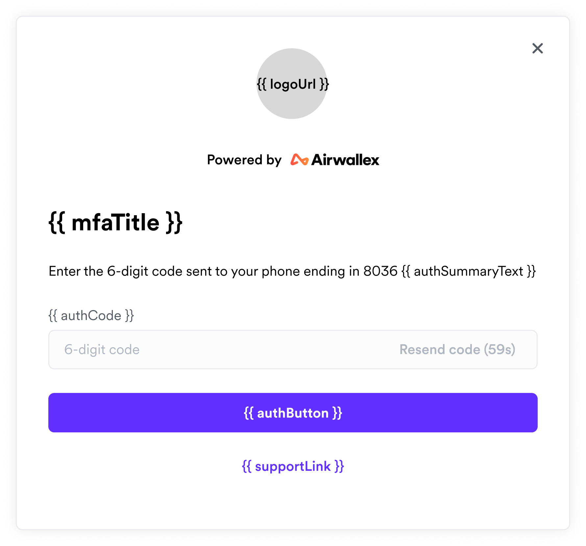

# Airwallex Login Widget

## Installation

```shell
npm install @airwallex/login-widget
```

## Get Started

Initialize the widget:

```js
import { LoginWidget } from '@airwallex/login-widget';

// Must initialize before creating any login widgets.
// These options will apply to all the login widgets.
LoginWidget.init({
  // The URL of the logo to display in the login widget.
  // The recommended size of the image is 72x72 px.
  logoUrl: 'https://your_website_logo_url',
  // The environment of the widget.
  env: 'production',
  // 'en' or 'zh', these are the supported languages right now
  locale: 'en',
});
```

Create a widget instance:

```js
import { LoginWidget } from '@airwallex/login-widget';

const loginWidget = new LoginWidget({
  // These are optional when instantiating the widget,
  // but are required before authenticating.
  // You could set them later using the widget's `update` method
  authSummaryText: 'your_auth_summary_justification_text',
  resourceId: 'the_unique_resource_id_to_be_authenticated',
  // You could also customize the labels
  labels: { emailLabel: 'User name' },
});
```

Listen to the cancel event, so that when the user clicks the exit button, you could unmount the widget

```js
loginWidget.on('cancel', () => {
  loginWidget.unmount();
});
```

Also remember to listen to the auth success event

```js
loginWidget.on('auth_success', ({ signedToken }) => {
  // Do something with the token
});
```

You will have to create a mask yourself, and mount the widget on top of it:

```html
<div class="mask">
  <div id="widget-container"></div>
</div>
```

```js
loginWidget.mount('#widget-container');
```

## `LoginWidget`

### `LoginWidget.init`

type: `(initOptions: WidgetInitOptions) => void;`

```typescript
interface WidgetInitOptions {
  /**
   * The URL of the logo to display in the login widget.
   * The recommended size of the image is 72x72 px.
   */
  logoUrl: string;
  /**
   * The environment of the login widget
   * @default 'production'
   */
  env?: Environment;
  /**
   * The language of the login widget.
   * @default 'en'
   */
  locale?: Language | undefined;
}

type Language = 'en' | 'zh';

type Environment = 'staging' | 'demo' | 'production';
```

### `LoginWidget.constructor`

type: `constructor(options?: LoginWidgetOptions);`

```typescript
interface LoginWidgetOptions {
  authSummaryText: string;
  resourceId: string;
  labels?: LoginWidgetOptionsLabels | undefined;
}

interface LoginWidgetOptionsLabels {
  authButton?: string;
  authCode?: string;
  emailLabel?: string;
  forgotPassword?: string;
  loginButton?: string;
  loginSubTitle?: string;
  loginTitle?: string;
  mfaTitle?: string;
  passwordLabel?: string;
  supportLink?: string;
}
```

### `LoginWidget.prototype.on`

#### `LoginWidget.prototype.on('ready', () => void)`

Emitted when widget is ready to use.

#### `LoginWidget.prototype.on('cancel', () => void)`

Emitted when the user clicks the exit button.

#### `LoginWidget.prototype.on('blur', (ev: LoginWidgetFieldEvent) => void)`

Emitted when the user blurs the field.

#### `LoginWidget.prototype.on('change', (ev: LoginWidgetFieldEvent) => void)`

Emitted when the user changes the value of a field.

#### `LoginWidget.prototype.on('focus', (ev: LoginWidgetFieldEvent) => void)`

Emitted when the user focuses the field.

```typescript
interface LoginWidgetFiledEvent {
  /**
   * Whether the input of the field is valid.
   */
  complete: boolean;
  /**
   * The name of the field.
   */
  field: FieldName;
}

type FieldName = 'username' | 'password' | 'authcode';
```

#### `LoginWidget.prototype.on('login_success', () => void)`

Emitted when the user login successfully.

#### `LoginWidget.prototype.on('auth_success', (ev: LoginWidgetAuthSuccessEvent) => void)`

Emitted when authentication is successful.

```typescript
interface LoginWidgetAuthSuccessEvent {
  signedToken: string;
}
```

#### `LoginWidget.prototype.on('error', (ev: LoginWidgetErrorEvent) => void)`

Emitted when error occurs.

```typescript
interface LoginWidgetErrorEvent {
  errorCode: string;
  message: string;
}

const ERROR_CODE_MAP = {
  BAD_CREDENTIAL: 'User name or password is incorrect',
  INVALID_AUTH_CODE: 'Invalid authorization code',
  INVALID_RESOURCE_ID: 'Invalid resource ID',
  TWO_FACTOR_AUTHENTICATION_NOT_ENABLED: 'Two-factor authentication is not enabled',
  UNKNOWN_ERROR: 'Unknown error',
  USER_AUTH_LOCKED: 'User has been locked due to multiple failed authentication attempts',
  USER_LOGIN_LOCKED: 'User has been locked due to multiple failed login attempts',
};
```

### `LoginWidget.prototype.removeEventListener`

Unsubscribe the event.

type: `(eventType, listenerToBeRemoved) => void;`

### `LoginWidget.prototype.mount`

Append the widget to the given DOM element.

If the DOM element could not be found, will throw an error.

type: `(domElement: string | HTMLElement) => void;`

`domElement` is either a CSS Selector or a DOM element.

### `LoginWidget.prototype.update`

You could also update the widget on the fly.

Every option used to initialize the widget could also be used to update the widget.

type: `(options: LoginWidgetUpdateOptions) => void;`

```typescript
interface LoginWidgetUpdateOptions {
  authSummaryText?: string | undefined;
  resourceId?: string | undefined;
  labels?: LoginWidgetOptionsLabels | undefined;
}
```

### `LoginWidget.prototype.unmount`

Remove the widget from the DOM.

All event listeners will NOT be removed, they must be removed manually.

type: `() => void;`

## The Customizable Parts



